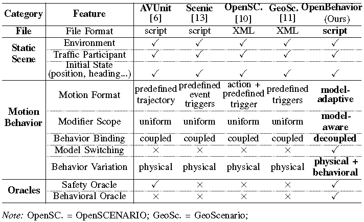

# Introduction to OpenBehavior

## What is OpenBehavior?

OpenBehavior is a behavior-based language for validating ADS in complex interaction scenarios. OpenBehavior integrates behavior models and a model-binding mechanism that enables users to bind agents with different decision policies within a scenario.

## Why do we need OpenBehavior?

The safety of ADSs fundamentally depends on their capability to handle complex multi-agent interactions. Critical scenarios,such as cut-ins or chain-reaction braking, emerge from dynamic  and autonomous interactions rather than static replays. However, most existing DSLs describe scenarios using predefined behavior scripts, where agent behaviors are largely fixed once the scenario starts.

This observation motivates the introduction of behavior models into scenario generation. Unlike fixed scripts that execute without considering interaction context, behavior models equip agents with reactive decision-making capabilities. Agents can continuously adjust their actions based on surroundings.

## What can you do with OpenBehavior?

Basic functions of OpenBehavior:

- Describe Different Scenes
- Provides a unified scenario description by combining a scenario script with a set of behavior models
- Build an adaptive orchestration algorithm that guides scenario generation toward users’ specified design intents while efficiently exploring critical system failures
- Find "bugs" of ADSs
- Connect to different simulators and autonomous driving systems (ADSs) for evaluation of different ADSs
- Participate in the development process of ADSs

## Comparison with Other Languages

OpenBehavior combines **adaptive behavior models** and **OBSpec-guided search** to explore diverse, safety-critical scenarios.

#### Feature Comparison Table

While conventional languages excel at defining physical parameter variations, OpenBehavior shifts the paradigm by introducing a novel policy-level abstraction. By decoupling agents from specific behavior models and introducing Intent Oracles, it enables the simulation of complex, reactive interactions. This approach explores both physical and behavioral search spaces, significantly expanding the coverage of safety-critical edge cases.
