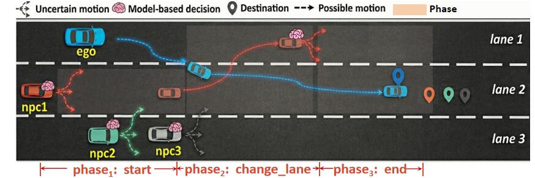

# OpenBehavior Examples

This section presents complete OpenBehavior examples that demonstrate how to describe interactive traffic scenarios, bind heterogeneous behavior models, and organize scenario logic using the OpenBehavior language.

## Example: Three-Lane Highway Interaction (Lane Change)

### Overview

This example demonstrates a lane-change interaction on a three-lane highway.

The ego vehicle starts in **Lane 1** and intends to merge into **Lane 2**, while surrounding vehicles perform different maneuvers driven by heterogeneous behavior models.

* **Npc1**: Starts in **Lane 2**, executes a forced lane change to **Lane 1**, then continues with a learning-based driving model.
* **Npc2 & Npc3**: Originate from **Lane 3** and attempt to merge into **Lane 2** ahead of the ego vehicle. Their behavior is controlled by the `Scenario Mode` configuration.

#### Scenario Illustration



*Figure: Lane-change interaction scenario used in this example.*

---

### Main Scenario Script

The following script defines the overall scenario and coordinates all traffic participants. It uses `parallel` to execute multiple agents simultaneously and `serial` to organize Npc1's staged driving behavior.

```python
import openbehavior_basic.osc
import adaptive.osc

scenario top:
    path: Path
    path.set_map("Town06")
    path.path_min_driving_lanes(3)

    ego_vehicle: Model3
    npc1: Rubicon
    npc2: TT
    npc3: A2
    
    # Batch bind behavioral configurations to Npc2 and Npc3
    adaptive_targets: list of string = [npc2, npc3]
    user_adaptive_npc_bm : string = adapt_npc_bm.adapt(scenario_mode: "mode_1")
    auto_orchestrates_behavior(user_adaptive_npc_bm, adaptive_targets)

    do parallel: 
        # Ego Vehicle: Lane 1 → Lane 2
        ego_vehicle.drive(path) with:
            set_behavior_model(behavior_type: Learning, model: Apollo, hyperparameters: default)
            set_behavior_logic(
                lane: "1, at:start", position: "80, at:start",
                lane: "2, at:end", position: "260, at:end"
            )

        # Npc1: Multi-stage interaction
        serial:
            start: npc1.drive(path) with:
                set_behavior_model(behavior_type: Learning, model: NAG-RL_agent)
                set_behavior_logic(lane: "2, at:start", position: "0, at:start", lane: "2, at:end", position: "[100..120], at:end")

            change_lane: parallel(duration: 5s):
                npc1.drive(path) with:
                    set_behavior_model(behavior_type: Rule, model: Directive, hyperparameters: "speed = 10")
                    set_behavior_logic(change_lane(lane_changes: 1, side: left))

            end: npc1.drive(path) with:
                set_behavior_model(behavior_type: Learning, model: NAG-RL_agent)
                set_behavior_logic(lane: "1, at:start", lane: "2, at:end", position: "10, ahead_of: ego_vehicle, at:end")
```

---

### Adaptive Behavior Library (`adaptive.osc`)

The `adaptive.osc` file defines a reusable behavior library that separates an agent's driving policy (**Behavior Model**) from its tactical objectives (**Behavior Logic**).

Through the `adapt` function and `choose` mechanism, it dynamically selects different behavior configurations based on the scenario mode, enabling non-deterministic and diverse traffic behaviors.

```python
struct adapt_npc_bm:
    def adapt(scenario_mode: string) is
        if scenario_mode == "mode_1":
            choose:
                {
                    model = {
                        model_name: "NAG-RL_agent",
                        behavior_type: "Learning",
                        hyperparameters: default
                    }
                },
                {
                    model = {
                        model_name: "behavior_agent",
                        behavior_type: "Rule",
                        hyperparameters: default
                    }
                }

        elif scenario_mode == "mode_2":
            choose:
                {
                    model = {
                        model_name: "cautious_behavior_agent",
                        behavior_type: "Rule",
                        hyperparameters: {
                            max_acc: 5,
                            max_speed: 20
                        }
                    }
                },
                {
                    model = {
                        model_name: "NAG-RL_agent",
                        behavior_type: "Learning",
                        hyperparameters: {
                            max_acc: 5,
                            max_speed: 20
                        }
                    }
                }
```

---

### OpenBehavior Basic Library

The `openbehavior_basic.osc` file defines the core built-in language constructs, including physical types, units, actors, and modifiers used across scenarios.

It provides:

- Physical types (time, length, velocity, angle)
- Unit system definitions
- Actor definitions and basic scenario components

The complete implementation is available in:

`openbehavior_basic.osc`

---

## Summary

In this example, you learned how to:

- Describe an interactive highway scenario
- Bind heterogeneous behavior models to traffic participants
- Construct multi-stage behaviors using `parallel` and `serial`
- Use `adaptive.osc` to enable behavior diversity
- Reuse built-in language components

Continue with the **Language Reference** to learn the detailed syntax of OpenBehavior constructs.
