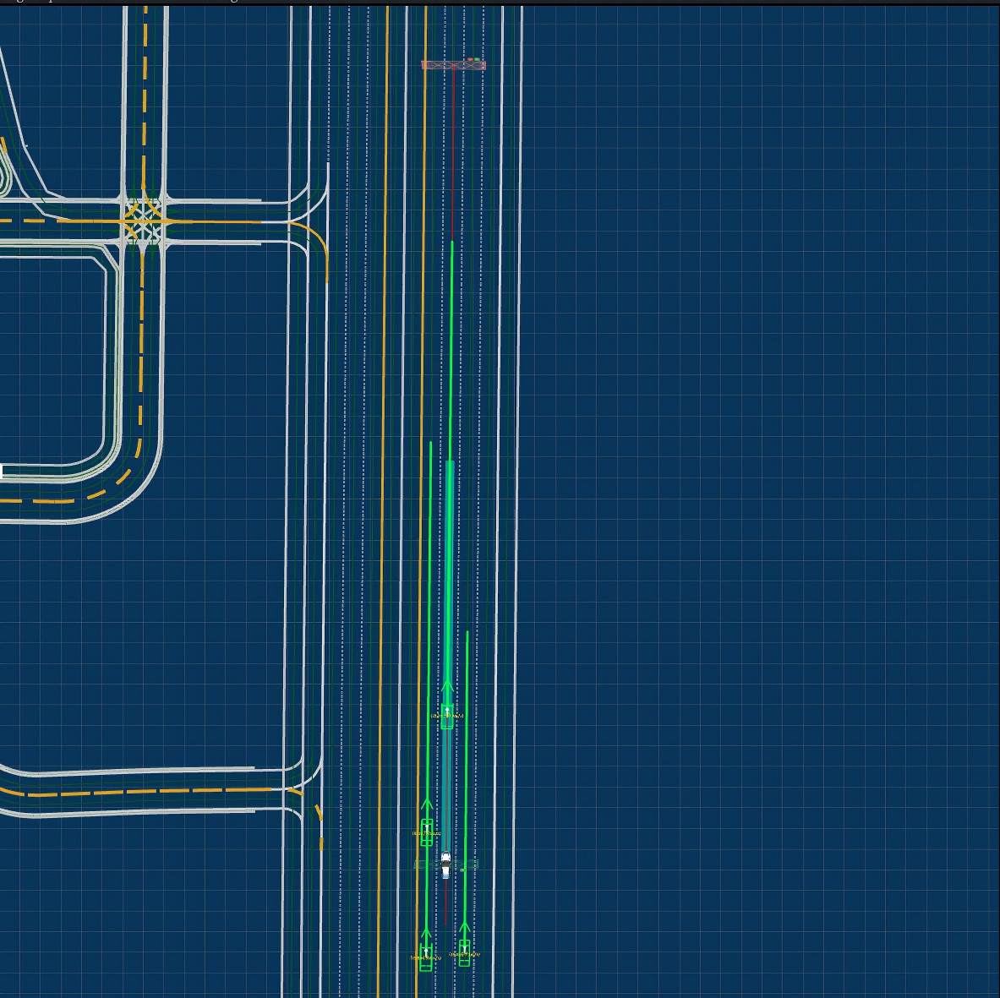

# OpenBehavior example
In this section, we will provide a few complete examples of OpenBehavior.

## S3-Lane Following on a Straight Road

### Scenario Script
'''
import avunit_basic.osc
import adaptive.osc

scenario top:
    path: Path
    path.set_map("Town04")
    path.path_min_driving_lanes(2)

    ego_vehicle: Model3
    npc1: Rubicon
    npc2: TT
    npc3: A2
    npc4: TT

    adaptive_targets: list of string = [npc4]
    user_adaptive_npc_bm : string = adapt_npc_bm.adapt(scenario_mode: "avunit_s8")

    do parallel(duration: 40s):
        ego_vehicle.drive(path) with:
            set_behavior_model(behavior_type: Script, model: cautious, hyperparameters: Default)
            set_behavior_logic(
                lane:"2, at:start",
                position:"0, at:start",
                lane:"2, at:end",
                position:"150, at:end"
            )
        npc1.drive(path) with:
            set_behavior_model(behavior_type: Script, model:normal, hyperparameters: Default)
            set_behavior_logic(
                lane:"[1..4], at:start",
                position:"[-20..30], ahead_of:ego_vehicle, at:start",
                lane:"[1..4], at:end",
                position:"[-20..30], ahead_of:ego_vehicle, at:end"
            )
        npc2.drive(path) with:
            set_behavior_model(behavior_type: Script, model:normal, hyperparameters: Default)
            set_behavior_logic(
                lane:"[1..4], at:start",
                position:"[-20..30], behind:ego_vehicle, at:start",
                lane:"[1..4], at:end",
                position:"[-20..30], ahead_of:ego_vehicle, at:end"
            )
        npc3.drive(path) with:
            set_behavior_model(behavior_type: Script, model:normal, hyperparameters: Default)
            set_behavior_logic(
                lane:"[1..4], at:start",
                position:"[-20..30], behind:ego_vehicle, at:start",
                lane:"[1..4], at:end",
                position:"[-20..30], ahead_of:ego_vehicle, at:end"
            )
        auto_orchestrates_behavior(user_adaptive_npc_bm, adaptive_targets)
'''

### Scenario Illustrations
