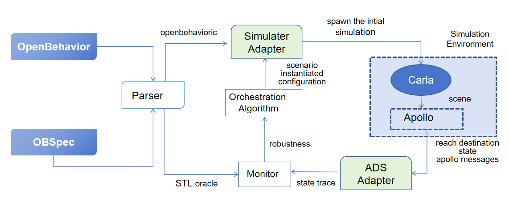

Welcome to OpenBehavior's documentation!
========================================

Explore our guides and examples for using Openbehavior.

   System Architecture of OpenBehavior Framework

Tool-Independence Architecture
-----------------------------

The core design philosophy of **OpenBehavior** is the strict decoupling of the scenario description layer from specific simulator and ADS (Autonomous Driving System) implementations. This ensures that the framework remains highly extensible and portable across different testing environments.

🏗️ Core Concept: Tool-Independence
~~~~~~~~~~~~~~~~~~~~~~~~~~~~~~~~~~

"Tool-independence" means the language layer (**OpenBehavior** and **OBSpec**) is completely isolated from the backend tools. Instead of writing scripts tied to a specific simulator's API, the user defines scenarios at a logical level.

Key Workflow
^^^^^^^^^^^^

1. **Parsing**: The **Parser** translates the high-level language into a structured, intermediate scenario configuration.
2. **Adaptation**: These configurations are instantiated via **lightweight adapters**.
3. **Execution**: The adapters map the abstract language constructs to the specific APIs of the target simulator and ADS.

🛠️ Reference Implementation: CARLA + Apollo
~~~~~~~~~~~~~~~~~~~~~~~~~~~~~~~~~~~~~~~~~~

In our research, we demonstrate this portability using a **CARLA + Apollo** setup. This is a challenging and representative case that validates the framework's capability:

- **Simulator Adapter**: Maps the scenario configurations to **CARLA** (e.g., spawning actors, setting weather, and initial states).
- **ADS Adapter**: Interfaces with **Apollo** to extract state traces and control messages.
- **Zero Core Modification**: Integrating this complex stack required only implementing these two adapters, without modifying the core OpenBehavior engine.

.. tip::

   **Extensibility**: This architecture allows researchers to switch to other simulators (like LGSVL or HighwayEnv) or different ADS stacks with minimal engineering overhead.

🔄 System Loop
~~~~~~~~~~~~~~

As shown in the architecture diagram:

- The **Monitor** receives the state trace from the ADS Adapter and evaluates it against **STL oracles**.
- The resulting **robustness** values are fed back into the **Orchestration Algorithm**.
- The algorithm then optimizes the next iteration of scenario parameters to effectively expose safety violations.

💡 Addressing Scenario Complexity and Human Effort
------------------------------------------------

A common inquiry regarding Domain-Specific Languages (DSLs) for autonomous driving is whether the effectiveness of scenario generation stems from the **language's design** or the **author's expertise**.

Our evaluation demonstrates that **OpenBehavior** significantly reduces the dependency on expert intervention through three key architectural advantages:

1. High-Level Abstraction vs. Low-Level Scripting
~~~~~~~~~~~~~~~~~~~~~~~~~~~~~~~~~~~~~~~~~~~~~~~~~

While complex scenarios *can* be hard-coded in simulators like CARLA or via Apollo's APIs, doing so requires deep knowledge of underlying middleware (e.g., ROS, Cyber RT).

- **OpenBehavior** abstracts these into logical primitives.
- **The Result:** Users focus on *what* the scenario should achieve (e.g., "cut-in with specific lateral velocity"), while the framework handles the *how* (API calls, sync, and initialization).

2. Systematic Search Space vs. Manual Tuning
~~~~~~~~~~~~~~~~~~~~~~~~~~~~~~~~~~~~~~~~~~~

The ability to expose safety violations in our experiments is not a result of "trial and error" by authors, but rather the **Orchestration Algorithm** navigating a formal search space defined by the language.

- **OpenBehavior** allows users to define **Logical Scenarios** with parameter ranges.
- The framework then automatically performs **fuzzing and optimization** to find the "edge cases" within those ranges—tasks that are practically impossible to perform manually with consistent results.

3. Quantitative Evidence of Expressiveness
~~~~~~~~~~~~~~~~~~~~~~~~~~~~~~~~~~~~~~~~~

To objectively assess the language beyond individual expertise, we emphasize its **Expressiveness**:

- **Complexity Handling:** OpenBehavior supports multi-agent synchronized behaviors and reactive triggers (e.g., "IF ADS accelerates, THEN Agent B swerves"), which are traditionally difficult to synchronize manually.
- **Oracle Integration:** By decoupling the **STL (Signal Temporal Logic) Oracle**, the language ensures that safety requirements are formally verified, removing the subjectivity of "what counts as a violation."

.. important::

   **Summary:** The success of the evaluation is a testament to the language’s ability to **systematize and automate** the search for complex safety-critical scenarios, effectively "distilling" expert knowledge into reusable, machine-executable templates.

Get started :doc:`here <Introduction_to_OpenBehavior>`
------------------------------------------------------

.. note::

   This project is under active development.

Contents
--------

.. toctree::
   :maxdepth: 2
   :caption: GETTING STARTED:

   Introduction_to_OpenBehavior
   tool-inde
   getting_started
   OpenBehavior_example

.. toctree::
   :maxdepth: 2
   :caption: LANGUAGE DESCRIPTION:

   obspec
   ob_se
   Types
   generate_scenarios_by_openbehavior
   semantics_of_describing_scenes
   define_specifications_by_OpenBehavior
   semantics_of_describing_specifications
   overall_BNF

.. toctree::
   :maxdepth: 2
   :caption: EXTENSION TO SIMULATIONS:

   OpenBehavior_connected_to

