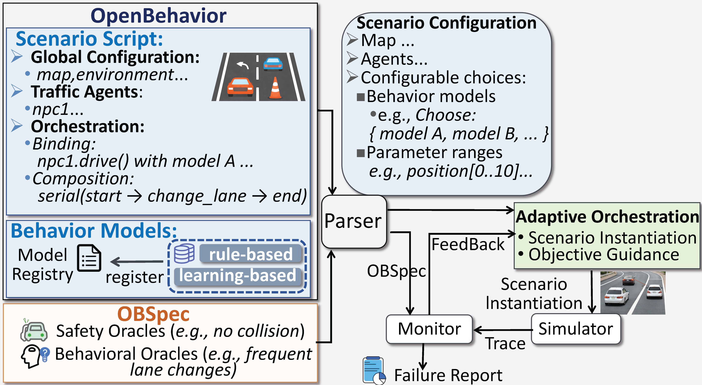

Welcome to OpenBehavior's documentation!
========================================

OpenBehavior is a behavior-centric scenario description language for testing autonomous driving systems (ADSs). It enables users to describe adaptive traffic scenarios with diverse behavior models, specify testing objectives using OBSpec, and generate interaction-rich scenarios for systematic ADS testing.

   Workflow using OPENBEHAVIOR to test ADS.

OpenBehavior consists of three complementary components:

* **OpenBehavior** – describes traffic scenarios using adaptive behavior models instead of predefined motion scripts.
* **OBSpec** – specifies both safety and behavioral testing objectives.
* **Adaptive Orchestration** – generates diverse interaction scenarios by exploring behavior models and scenario parameters.

Getting Started
---------------

If you are new to OpenBehavior, we recommend starting with :doc:`Introduction_to_OpenBehavior`, which introduces the motivation, core concepts, and main capabilities of the language.

Contents
--------

.. toctree::
   :maxdepth: 2
   :caption: GETTING STARTED:

   Introduction_to_OpenBehavior
   getting_started
   OpenBehavior_example_highway_lane_change

.. toctree::
   :maxdepth: 2
   :caption: LANGUAGE REFERENCE:

   Types
   generate_scenarios_by_openbehavior
   ob_se
   overall_BNF
   obspec_bnf
   obspec

.. note::

   OpenBehavior is under active development. We welcome feedback and contributions from the community.
